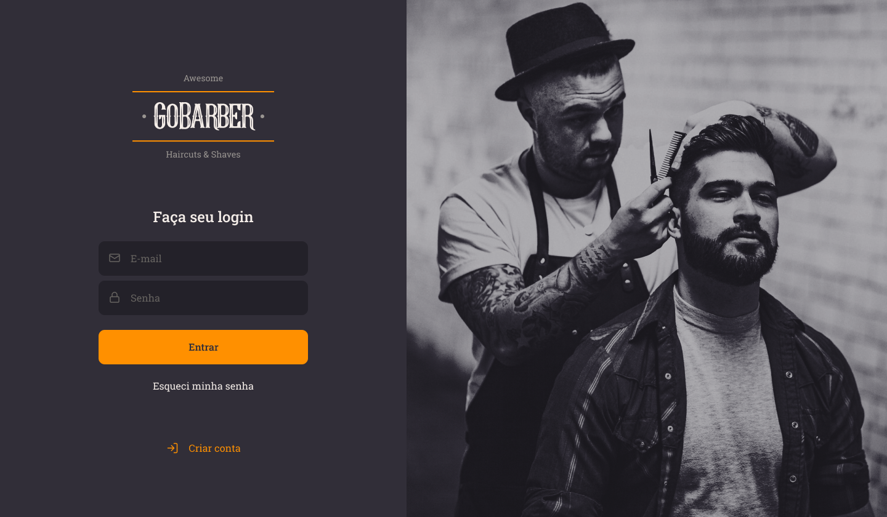
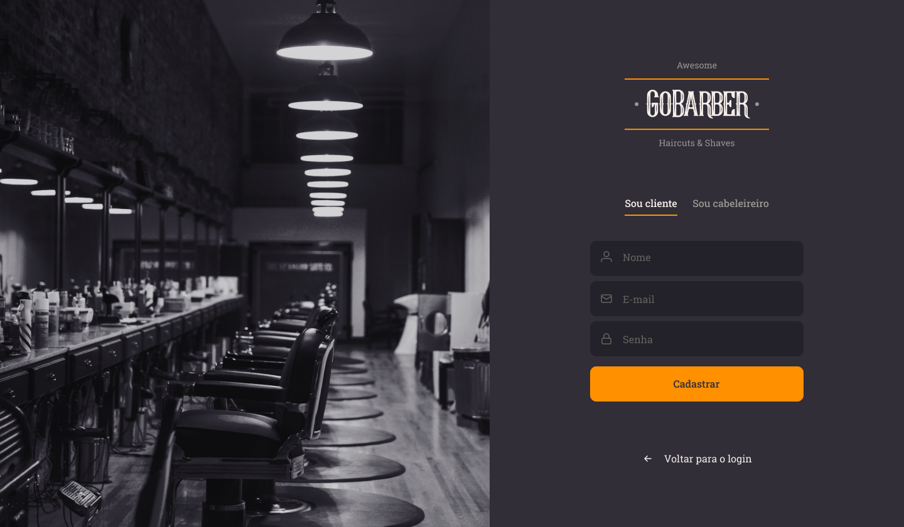
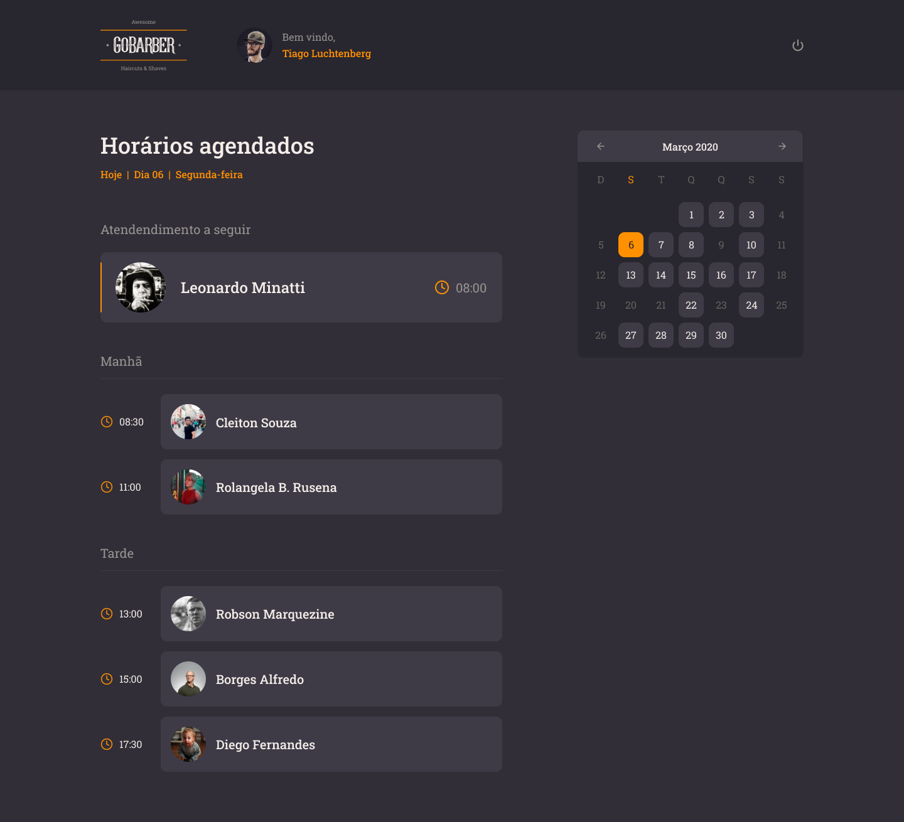
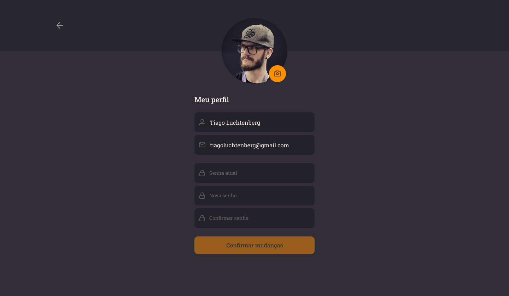

## Prints da aplicação

## Como executar

Primeiramente baixe, configure e execute o [backend](https://github.com/RCout1nho/gobarber-backend)

Após esses passos, basta executar: `yarn` para instalar as dependências e `yarn start` para rodar a aplicação
